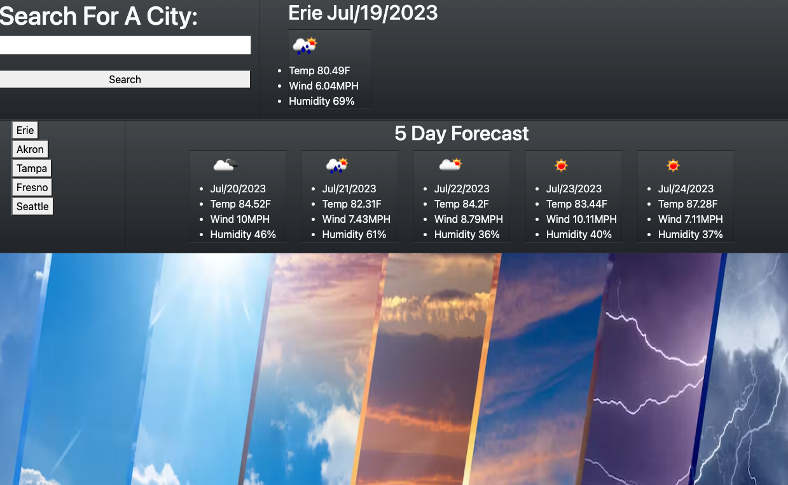

# Weather_app

Here at this repo I create a [weather app](https://olegreg762.github.io/Weather_app/) with a 5 day forecast. The app retrieves the weather 
data from the 
[Open Weather API](https://openweathermap.org/forecast5). 
The user will type in a city and the javascript will make an API call to the
[Geocoding API](https://openweathermap.org/api/geocoding-api) from 
[OpenWeather](https://openweathermap.org).
This will determine the latitude and longitude of the city which will then be used to get the weather data.  
I use a couple different libraries to build the javascript which include
[Day.js](https://day.js.org/)
and
[jQuery](https://jquery.com/).
 
